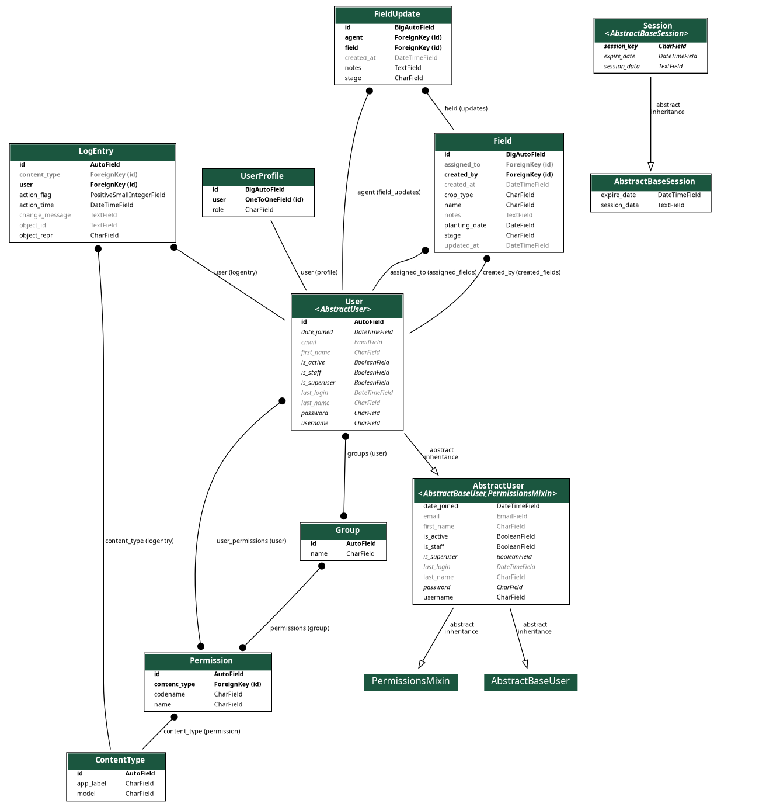

# smart_farm

A Django web app for tracking agricultural fields and coordinating between farm admins and field agents. Admins manage fields and agents from a central dashboard; agents log updates on whatever fields are assigned to them.

---

## Table of Contents

- [What it does](#what-it-does)
- [Stack](#stack)
- [Project layout](#project-layout)
- [How requests flow](#how-requests-flow)
- [Data models](#data-models)
- [Roles and access control](#roles-and-access-control)
- [Getting it running](#getting-it-running)
- [Routes](#routes)
- [Field status logic](#field-status-logic)
- [API](#api)
- [Settings worth knowing](#settings-worth-knowing)

---

## What it does

Admins create fields, set a planting date and crop type, and assign them to agents. Agents see their assigned fields on login and can log updates — recording a new stage and some notes. Every update is saved to a history log on the field. The system marks a field as "At Risk" if it has been in `planted` or `growing` stage for more than 90 days without progressing.

That's roughly it. There's a Django admin panel for superusers and a REST API layer built on DRF with JWT auth, though the main interface is server-rendered HTML with Tailwind for styling.

---

## Stack

| | |
|---|---|
| Backend | Django 5.1+ |
| REST API | Django REST Framework 3.15+ |
| Auth tokens | djangorestframework-simplejwt 5.3+ |
| Filtering | django-filter 24.0+ |
| Frontend | Tailwind CSS via CDN (no build step) |
| Database | SQLite in development |
| Language | Python 3.10+ |

---

## Project layout

```
smart_farm/
│
├── manage.py
├── requirements.txt
│
├── smartseason/                  # Django project config
│   ├── settings.py
│   ├── urls.py                   # root URL conf — delegates to fields/urls.py
│   ├── wsgi.py
│   └── asgi.py
│
└── fields/                       # the only app
    ├── models.py                 # UserProfile, Field, FieldUpdate
    ├── serializers.py            # DRF serializers
    ├── signals.py                # creates UserProfile when a User is saved
    ├── admin.py
    ├── apps.py                   # loads signals on startup
    ├── urls.py
    │
    ├── views/
    │   ├── auth.py               # login / logout
    │   └── web.py                # everything else — dashboard, fields, agents
    │
    ├── migrations/
    │   └── 0001_initial.py
    │
    └── templates/
        ├── base.html             # shared nav, flash messages, footer
        ├── landing.html
        ├── setup_admin.html
        ├── auth/
        │   └── login.html
        └── fields/
            ├── dashboard.html        # base dashboard template
            ├── dashboard_admin.html  # extends dashboard.html
            ├── dashboard_agent.html  # extends dashboard.html
            ├── field_list.html
            ├── field_detail.html
            ├── field_form.html       # used for both create and edit
            ├── field_confirm_delete.html
            ├── agent_list.html
            ├── agent_form.html
            └── agent_confirm_delete.html
```

The project package is called `smartseason`; the app is `fields`. A bit confusing at first glance but they're clearly separated.

---

## How requests flow

### General architecture

## Data model diagram

The relationships between core entities are shown below:



```
Browser / API client
        |
        v
smartseason/urls.py
        |
        |-- /admin/         --> Django admin
        |-- /setup_admin/   --> one-time setup view
        |-- /               --> landing page
        |-- /*              --> fields/urls.py
                                    |
                            views/auth.py  or  views/web.py
                                    |
                              Django ORM
                                    |
                              db.sqlite3
```

---

### Login

```
GET /login/
  -- already logged in? --> redirect /dashboard/
  -- not logged in?     --> show login form

POST /login/
  authenticate(username, password)
    |
    |-- valid   --> login(request, user) --> redirect /dashboard/
    |-- invalid --> flash error, re-render form
```

---

### Dashboard

The dashboard view checks the user's role and branches from there. Both paths are rendered through `dashboard.html` — the admin and agent templates just extend it without adding anything, so shared layout changes go in one place.

```
GET /dashboard/
  @login_required
        |
        |-- profile.is_admin()
        |       |
        |       +--> query all fields + agents + last 10 FieldUpdates
        |       +--> render dashboard_admin.html
        |
        |-- profile.is_agent()  (or no profile)
                |
                +--> query Field WHERE assigned_to = request.user
                +--> render dashboard_agent.html
```

---

### Posting a field update

This is the main thing agents do. The view runs inside a transaction so the `FieldUpdate` row and the `Field.stage` change either both commit or both roll back.

```
POST /fields/<pk>/update/
  @login_required
        |
        |-- admin?  --> Field.objects.get(pk=pk)
        |-- agent?  --> Field.objects.get(pk=pk, assigned_to=request.user)
        |               (404 if not their field)
        |
        |-- notes empty? --> flash error, redirect back
        |
        transaction.atomic()
          |-- FieldUpdate.objects.create(...)
          |-- field.stage = stage
          |-- field.save()
        |
        redirect /fields/<pk>/
```

---

### First-time admin setup

`/setup_admin/` creates the first superuser. It redirects to `/admin/login/` permanently once any superuser row exists, so it can't be used to create additional superusers later.

```
GET /setup_admin/
  superuser exists? --> redirect /admin/login/
  no superuser?     --> show form

POST /setup_admin/
  create User(is_superuser=True, is_staff=True)
  redirect /admin/login/
```

Worth noting: the signal in `signals.py` fires on this user save and creates a `UserProfile` with `role=admin` automatically.

---

## Data models

### UserProfile

A one-to-one extension of Django's `User`. Only adds a `role` field — `admin` or `agent`. The signal in `signals.py` creates one automatically whenever a `User` is saved for the first time, so you should never have a `User` without a `UserProfile` unless something went wrong during setup.

```
UserProfile
  user  -- OneToOne --> auth.User
  role  -- "admin" | "agent"
```

Methods: `is_admin()`, `is_agent()` — used throughout the views.

---

### Field

The main model. Tracks a single agricultural field from planting to harvest.

```
Field
  name           CharField       indexed
  crop_type      CharField
  planting_date  DateField       validated: must not be in the future
  stage          CharField       planted | growing | ready | harvested
  assigned_to    FK --> User      nullable — field can be unassigned
  created_by     FK --> User
  notes          TextField       optional
  created_at     DateTimeField   auto
  updated_at     DateTimeField   auto
```

Two computed properties worth knowing:

`days_since_planting` — straightforward date arithmetic against today.

`status` — derived from `stage` and `days_since_planting`:
- `harvested` stage → `completed`
- planted or growing for more than 90 days → `at_risk`
- anything else → `active`

The model calls `full_clean()` inside `save()`, so validation runs on every write — not just through forms.

---

### FieldUpdate

An append-only log. Every time someone posts to `/fields/<pk>/update/`, a row is added here and `Field.stage` is updated to match.

```
FieldUpdate
  field       FK --> Field
  agent       FK --> User
  stage       CharField    what stage was recorded at the time
  notes       TextField    required — blank notes are rejected in the view
  created_at  DateTimeField auto
```

Ordered by `-created_at` by default, so `.all()` returns most recent first.

---

### Relationships

```
auth.User  <---OneToOne--->  UserProfile
    |
    |-- (created_by) ----+
    |-- (assigned_to) ---+--->  Field  ---FK--->  FieldUpdate
    |-- (agent) --------------------------FK--->  FieldUpdate
```

---

## Roles and access control

Two custom decorators in `views/web.py` handle this — `@require_admin` and `@require_agent`. Both wrap `@login_required`, so unauthenticated requests go to `/login/` and authenticated requests with the wrong role get a flash error and a redirect to `/dashboard/`.

| Action | Admin | Agent |
|---|---|---|
| Dashboard | all fields | assigned fields only |
| Create / edit / delete field | yes | no |
| View field detail | any field | assigned fields only |
| Post field update | any field | assigned fields only |
| Create / delete agents | yes | no |
| Django admin panel | yes (superuser) | no |

---

## Getting it running

```bash
git clone https://github.com/your-username/smart_farm.git
cd smart_farm

python -m venv venv
source venv/bin/activate    # Windows: venv\Scripts\activate

pip install -r requirements.txt

python manage.py migrate
python manage.py runserver
```

Then go to `http://127.0.0.1:8000/setup_admin/` to create the first admin account. After that the route locks itself out and you log in normally at `/login/`.

If you'd rather use Django's own command:

```bash
python manage.py createsuperuser
```

That also triggers the signal and creates a `UserProfile` with `role=admin`.

---

## Routes

| URL | Handler | Who can access |
|---|---|---|
| `/` | landing page | public |
| `/setup_admin/` | first-time setup | public, one-time only |
| `/login/` | login form | public |
| `/logout/` | logout | logged in |
| `/dashboard/` | role-aware dashboard | logged in |
| `/fields/` | field list | admin |
| `/fields/add/` | create field | admin |
| `/fields/<pk>/` | field detail + update form | logged in (scoped by role) |
| `/fields/<pk>/edit/` | edit field | admin |
| `/fields/<pk>/delete/` | delete field | admin |
| `/fields/<pk>/update/` | POST: add update | logged in (scoped by role) |
| `/agents/` | agent list | admin |
| `/agents/add/` | create agent | admin |
| `/agents/<pk>/delete/` | delete agent | admin |
| `/admin/` | Django admin | superuser |

---

## Field status logic

```python
@property
def status(self):
    if self.stage == self.STAGE_HARVESTED:
        return self.STATUS_COMPLETED
    if self.days_since_planting > 90 and self.stage in [self.STAGE_PLANTED, self.STAGE_GROWING]:
        return self.STATUS_AT_RISK
    return self.STATUS_ACTIVE
```

The 90-day threshold is hardcoded in the model. If you want that configurable, it would need to move to settings or a model field.

---

## API

The DRF setup is in place — serializers, JWT config, session auth fallback — but API views and routers aren't wired up in the current `urls.py`. The serializers in `fields/serializers.py` are ready to use if you add viewsets and register them.

To get a JWT token once the endpoints are set up:

```http
POST /api/token/
Content-Type: application/json

{
  "username": "admin",
  "password": "yourpassword"
}
```

```json
{
  "access": "...",
  "refresh": "..."
}
```

Then attach it to requests:

```http
Authorization: Bearer <access_token>
```

Tokens are handled by `djangorestframework-simplejwt` with default expiry and rotation settings unless overridden in `REST_FRAMEWORK` config.

---

## Settings worth knowing

`TIME_ZONE = "Africa/Nairobi"` — everything is in EAT (UTC+3). If you're deploying elsewhere, keep `USE_TZ = True` so datetimes stay timezone-aware in the database.

`SESSION_COOKIE_AGE = 60 * 60 * 8` — sessions expire after 8 hours. Combined with `SESSION_EXPIRE_AT_BROWSER_CLOSE = True`, closing the browser also kills the session.

`SECRET_KEY` is the Django default insecure key. Replace it before putting this anywhere public:

```bash
python -c "from django.core.management.utils import get_random_secret_key; print(get_random_secret_key())"
```

For production, the short list:
- New `SECRET_KEY` via environment variable
- `DEBUG = False`
- Add your domain to `ALLOWED_HOSTS`
- Swap SQLite for Postgres
- Run `python manage.py collectstatic` and serve static files through nginx or a CDN
- HTTPS